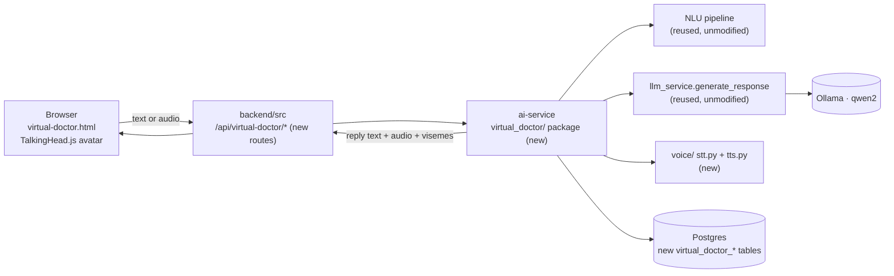
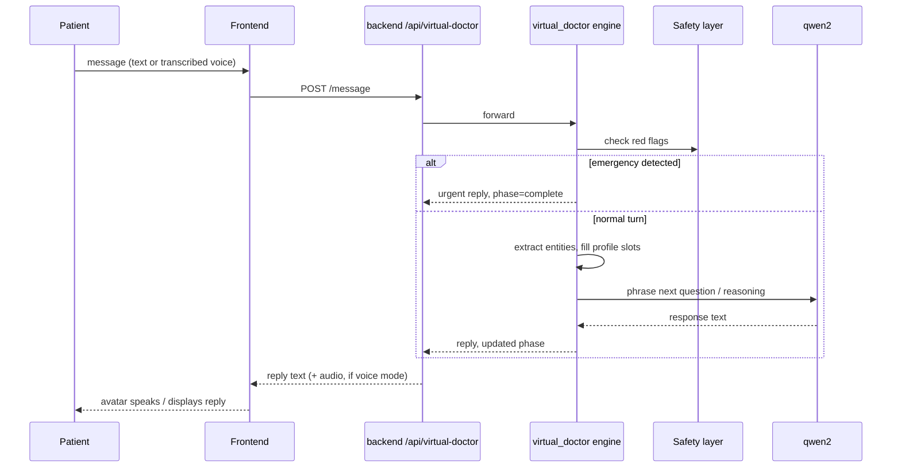
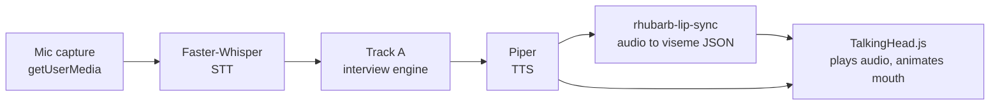
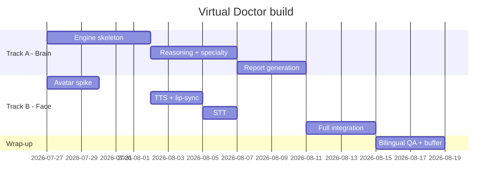

# AI Virtual Doctor — System Plan

*Additive module, isolated build. MedOrbit graduation-project addition.*

A 3D talking doctor avatar that runs a bilingual (Arabic/English) medical interview by voice or text, reasons toward an urgency level and specialty, and produces a downloadable report — built as a self-contained addition to the existing MedOrbit codebase, isolated enough to disable without touching anything already working.

- Timeline: 4–6 weeks, solo
- **Track A — the Brain** (build first)
- **Track B — the Face** (build second)
- New route prefix: `/api/virtual-doctor/*`

This is a planning document only — nothing described here has been built yet.

---

## How this stays additive

Everything below is new files, new tables, and a new route prefix. Nothing in `chatbot_conversations`, `symptom_triage_sessions`, the existing `/chat` and `/triage` endpoints, or the current symptom-checker page is modified. The Brain *reads* from existing ai-service internals (the Ollama client, the NLU pipeline, the safety layer) by importing them, not by editing them.

> **The one unavoidable touch:** mounting the new router requires a single `include_router(...)` line in `ai-service/chatbot/main.py`. That's the only line in an existing file this plan asks for — worth a heads-up to Omar even though it's additive, since it's the one shared file. Everything else lives in new files under a new `virtual_doctor/` package.

---

## System overview

The browser talks to the existing Node backend, which proxies to a new `virtual_doctor` package inside the existing FastAPI ai-service — the same pattern the current chatbot already uses for its own proxy call.



---

## Track A — The Brain (build first)

### What already exists vs. what's new

A read-only survey of `ai-service/` found real, reusable pieces — but the "triage" that exists today is a single-shot symptom-list → specialty lookup, not a multi-turn interview. The conversational engine itself is genuinely new.

| Piece | Status | Detail |
|---|---|---|
| `llm_service.generate_response()` | **Reuse** | Ollama/qwen2 client with bilingual prompt templates — import directly, no changes needed. |
| `db.get_pool()` | **Reuse** | asyncpg pool singleton with `medorbit` schema search path already set. |
| `MedicalSafetyLayer` | **Reuse** | Bilingual emergency-keyword regex layer — becomes the interview's safety gate, checked every turn. |
| `IntentClassifier` / `EntityExtractor` | **Reuse** | Bilingual keyword/fuzzy matching — reused per-turn to pull symptom, duration, severity entities out of free text. |
| `SymptomSpecialtyEngine.match()` | **Reuse** | Rule-based specialty scoring against `symptom_specialty_mappings` — becomes a cross-check under the LLM's specialty suggestion, not the whole triage. |
| Multi-turn interview / dialogue manager | **New** | Chief-complaint detection, per-complaint question flow, a profile that fills but never re-asks. The core of Track A. |
| Differential + urgency reasoning | **New** | Synthesizes the filled profile into urgency / differential / recommended specialty & next step. |
| Real RAG (guideline retrieval) | **New** | Today's `retrieve_context()` is a JSON context shaper, not semantic search — no `pgvector`, no embeddings table exists yet. |
| PDF report generator | **New** | No PDF rendering exists anywhere in the repo today. |

### Interview engine design

Full hand-written decision trees per condition don't fit a 4–6 week solo build. Instead: a small data-driven config per chief complaint, plus a state machine that decides what to ask next and lets the LLM phrase the question naturally.

1. **Chief-complaint detection** — extend `EntityExtractor`'s categories to classify the opening complaint (headache, chest pain, rash, abdominal pain, fever/cough, generic-fallback).
2. **Per-complaint flow config** — a JSON file per complaint listing required slots (e.g. chest pain: onset, character, radiation, triggers, associated symptoms) with bilingual question text and red-flag keywords. Config files, not DB rows — easier to iterate and diff during the build.
3. **Turn loop** — extract entities from the patient's message → fill only *empty* slots in the profile (never overwrite an answered one) → run the safety layer → if a red flag fires, short-circuit to an urgent recommendation immediately → otherwise pick the next unfilled required slot and have the LLM phrase that question conversationally, with the template string as a fallback if the LLM call fails.
4. **Reasoning phase** — once required slots are filled, send the full profile to qwen2 for urgency/differential/next-step, then cross-check its urgency against `SymptomSpecialtyEngine`'s rule-based score — take whichever is *more* urgent. Never let the LLM alone downgrade urgency.
5. **Report assembly** — structured JSON (profile + reasoning) rendered to a bilingual PDF.

#### On RAG — recommend Phase 2, not Phase 1

Real guideline retrieval (ingesting WHO/CDC/NICE, chunking, embedding into `pgvector`, retrieval-augmented prompting) is valuable but slow to do trustworthily in two languages. For the 4–6 week MVP, skip it: the bilingual prompt templates, safety layer, and specialty mapping already encode enough structure. If time remains after both tracks work, add a *small curated* knowledge snippet per chief complaint (5–10 conditions, hand-picked from WHO/NICE, no scraping pipeline) rather than a full RAG system — same demo credibility, a fraction of the risk.

### Data flow



### Database schema additions

New tables only — no `ALTER` on `chatbot_conversations`, `symptom_triage_sessions`, or anything existing. Follows the `db/` tree's convention (numbered file, `medorbit` search path, UUID PKs).

```sql
-- db/16_virtual_doctor_tables.sql
SET search_path TO medorbit, public;

CREATE TABLE IF NOT EXISTS virtual_doctor_sessions (
  id                       UUID PRIMARY KEY DEFAULT uuid_generate_v4(),
  user_id                  UUID REFERENCES users(id) ON DELETE SET NULL,
  session_id               VARCHAR(64) NOT NULL UNIQUE,
  language                 VARCHAR(5)  NOT NULL DEFAULT 'en',
  chief_complaint          VARCHAR(100),
  phase                    VARCHAR(30) NOT NULL DEFAULT 'greeting',
                           -- greeting | interviewing | reasoning | complete
  patient_profile          JSONB NOT NULL DEFAULT '{}',
  urgency_level            VARCHAR(20),  -- emergency | urgent | routine
  recommended_specialty_id UUID REFERENCES specialties(id),
  differential             JSONB,
  created_at               TIMESTAMP WITH TIME ZONE DEFAULT CURRENT_TIMESTAMP,
  updated_at               TIMESTAMP WITH TIME ZONE DEFAULT CURRENT_TIMESTAMP
);

CREATE TABLE IF NOT EXISTS virtual_doctor_messages (
  id                 UUID PRIMARY KEY DEFAULT uuid_generate_v4(),
  session_id         UUID NOT NULL REFERENCES virtual_doctor_sessions(id) ON DELETE CASCADE,
  role               VARCHAR(10) NOT NULL,  -- patient | doctor
  message_text       TEXT NOT NULL,
  audio_url          TEXT,
  extracted_entities JSONB,
  created_at         TIMESTAMP WITH TIME ZONE DEFAULT CURRENT_TIMESTAMP
);

CREATE TABLE IF NOT EXISTS virtual_doctor_reports (
  id           UUID PRIMARY KEY DEFAULT uuid_generate_v4(),
  session_id   UUID NOT NULL REFERENCES virtual_doctor_sessions(id) ON DELETE CASCADE,
  pdf_path     TEXT,
  report_json  JSONB NOT NULL,
  created_at   TIMESTAMP WITH TIME ZONE DEFAULT CURRENT_TIMESTAMP
);
```

### API endpoints

| Layer | Method & path | Purpose |
|---|---|---|
| ai-service | `POST /virtual-doctor/start` | Create a session, return the opening greeting in the requested language. |
| ai-service | `POST /virtual-doctor/message` | One interview turn — body `{session_id, message}`, returns `{reply, phase, profile_snapshot}`. |
| ai-service | `GET /virtual-doctor/session/{id}` | Full session state, for resuming or debugging. |
| ai-service | `POST /virtual-doctor/report/{id}` | Generate the structured report + PDF, return a download URL. |
| backend | `/api/virtual-doctor/*` | Thin proxy + persistence layer mirroring the four routes above, using `authenticateOptional` to match the existing chat endpoint's anonymous-allowed pattern. |

### Folder structure

```
ai-service/
  virtual_doctor/
    __init__.py
    router.py            # FastAPI router — the one include_router() into main.py
    interview_engine.py  # state machine: fill slots, pick next question
    reasoning.py          # differential / urgency / specialty synthesis
    report_generator.py   # structured report -> bilingual PDF (WeasyPrint)
    schemas.py             # pydantic request/response models
    flows/                 # data-driven per-complaint question configs
      headache.json
      chest_pain.json
      abdominal_pain.json
      rash.json
      fever_cough.json
      generic.json
    rag/                    # phase 2 / stretch
      guideline_snippets.json

backend/src/
  routes/virtualDoctor.routes.js
  controllers/virtualDoctor.controller.js
  services/virtualDoctor/virtualDoctor.service.js
  repositories/virtualDoctor.repository.js

db/
  16_virtual_doctor_tables.sql
```

### Libraries

| Library | Role |
|---|---|
| [WeasyPrint](https://github.com/Kozea/WeasyPrint) | HTML/CSS → PDF. Handles Arabic RTL text well; write the report as an HTML template and render it, rather than fighting a lower-level PDF API. |
| [pgvector](https://github.com/pgvector/pgvector) | Only needed if/when the Phase 2 RAG stretch goal happens — Postgres extension for embedding storage + similarity search. |
| Ollama + [qwen2](https://ollama.com/library/qwen2) | Already running — no new dependency, just new prompts. |

### Phased build plan

| Phase | Effort | Deliverable |
|---|---|---|
| 1 — Engine skeleton | ~6 days | State machine + 2–3 complaint flows (headache, chest pain, generic). Multi-turn text interview that fills a profile and never re-asks. |
| 2 — Reasoning | ~5 days | Urgency/differential/specialty synthesis with the rule-based cross-check; flows expanded to 5 complaints. |
| 3 — Report | ~4 days | Structured JSON report + bilingual PDF, download endpoint. |
| 4 — RAG (stretch) | optional | Curated guideline snippets for 5–10 complaints — only if Phases 1–3 and Track B finish early. |

---

## Track B — The Face (build second)

### Avatar library comparison

Given the priority is a working demo over maximum realism, the choice is fairly clear-cut:

| Option | Verdict | Why |
|---|---|---|
| [TalkingHead.js](https://github.com/met4citizen/TalkingHead) + [Ready Player Me](https://readyplayer.me/) avatar | **Recommended** | Purpose-built for exactly this: loads an RPM `.glb`, drives lip-sync from viseme timing, plus built-in blinking, idle motion, and expressions. Wraps three.js so you're not writing an animation mixer by hand. RPM's avatar creator can produce a doctor-like look (coat, styling) in minutes, free. |
| Ready Player Me + raw [three.js](https://threejs.org/) | Not recommended here | Full control, but you'd hand-build the blend-shape animation mixer, blink loop, and lip-sync driver that TalkingHead.js already provides — pure extra effort for the "fastest to demo" priority. |
| 2D/Live2D fallback | Backup plan only | Much faster to wire up, far lower "wow" factor. Keep as a fallback if the 3D avatar spike stalls in week 1 — swap in without touching the interview engine, since the avatar is a separate frontend module either way. |

### Voice pipeline



New service code: `ai-service/virtual_doctor/voice/stt.py` wraps [faster-whisper](https://github.com/SYSTRAN/faster-whisper) (multilingual model, handles Arabic); `tts.py` shells out to the [Piper](https://github.com/rhasspy/piper) CLI binary with a cached Arabic voice (e.g. `ar_JO`) and an English voice. [rhubarb-lip-sync](https://github.com/DanielSWolf/rhubarb-lip-sync) turns the Piper WAV into a viseme timing track that TalkingHead.js consumes natively.

### API endpoints

| Method & path | Purpose |
|---|---|
| `POST /virtual-doctor/voice/turn` | Combined round trip: audio in → transcribe → run through the interview engine → synthesize reply → return `{reply_text, audio_url, visemes, phase}` in one call, to cut round-trip latency. |

### Frontend structure

```
frontend/
  public/virtual-doctor.html
  src/js/virtual-doctor.js          # orchestration: mic -> API -> avatar
  src/js/virtual-doctor-avatar.js   # wraps TalkingHead.js: speak(), idle(), setExpression()
  src/css/virtual-doctor.css
```

### Phased build plan

| Phase | Effort | Deliverable |
|---|---|---|
| 1 — Avatar spike | ~3 days | TalkingHead.js + RPM avatar rendering standalone: idle motion and blinking verified, no voice yet. Run this early — even overlapping Track A's start — since it's the single biggest unknown. |
| 2 — TTS + lip-sync | ~3 days | Piper + rhubarb wired to the avatar, driven by typed text (no mic yet). |
| 3 — STT | ~2 days | Faster-Whisper wired: mic → text → existing Track A pipeline. |
| 4 — Integration | ~4 days | End-to-end voice loop, Arabic voice testing, urgency-driven expressions (e.g. a concerned look when a red flag fires). |

---

## High-risk / time-consuming items

- **Avatar lip-sync quality** — the single biggest unknown in the whole plan. Run the Phase 1 avatar spike in week 1, not week 4 — if TalkingHead.js integration stalls, you need time left to fall back to the 2D option.
- **Arabic voice quality** — Faster-Whisper's multilingual models handle Arabic reasonably; Piper's Arabic voices exist but are fewer and rougher than its English ones. Test with real Arabic phrases in week 1 of Track B, before committing to the pipeline shape.
- **rhubarb-lip-sync is English-tuned** — expect looser mouth-shape accuracy on Arabic audio than on English. Acceptable for a graduation demo — worth naming as a known limitation rather than something to chase perfection on.
- **Serial latency** — STT → LLM → TTS → viseme generation is a real chain — unoptimized, a turn could take several seconds. Budget a visible "thinking" avatar state to mask it rather than trying to eliminate the latency itself under deadline pressure.
- **Real RAG is a stretch goal, not a dependency** — treat guideline retrieval as optional polish. Nothing in Track A or B depends on it working.

---

## Combined schedule (5 weeks, fits inside a 4–6 week window)



The avatar spike deliberately overlaps the start of Track A — it's the riskiest unknown, so it gets first look even though the brain is the priority to finish first.

---

## Open decisions before writing code

- [ ] Confirm the one shared-file touch (the `include_router()` line in `ai-service/chatbot/main.py`) with Omar before starting, since it's the sole edit to an existing file.
- [ ] Decide whether virtual-doctor sessions require login or stay anonymous like the current chat/symptom-checker — affects whether `authenticateOptional` is enough or full `authenticate` is needed.
- [ ] Pick which 5 chief-complaint flows to build first (headache / chest pain / abdominal pain / rash / fever-cough suggested).
- [ ] Confirm scope cut order if week 3 arrives behind schedule: RAG stretch drops first, then complaint-flow count, then avatar expressiveness — voice pipeline and PDF report should be the last things cut, since they're the demo's payoff.
